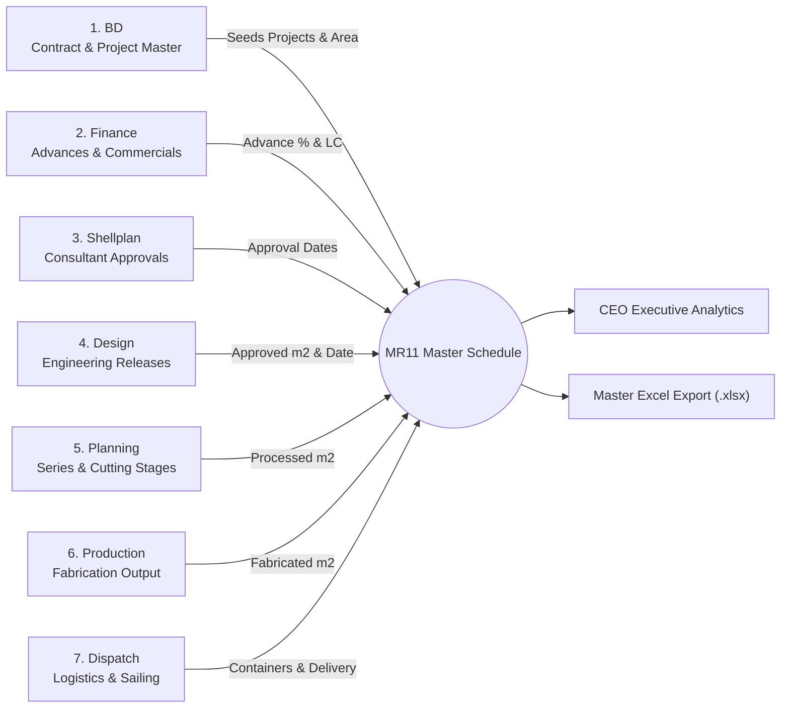
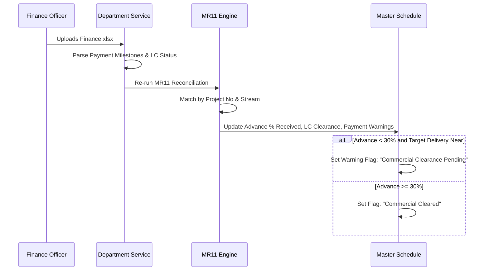
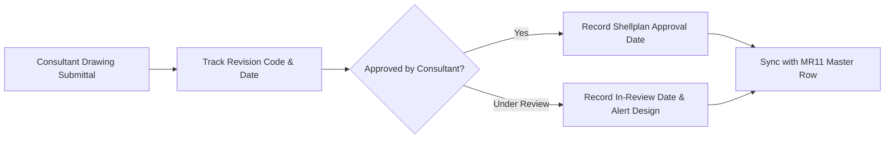
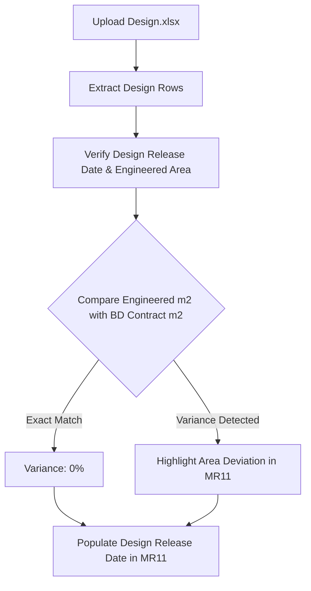
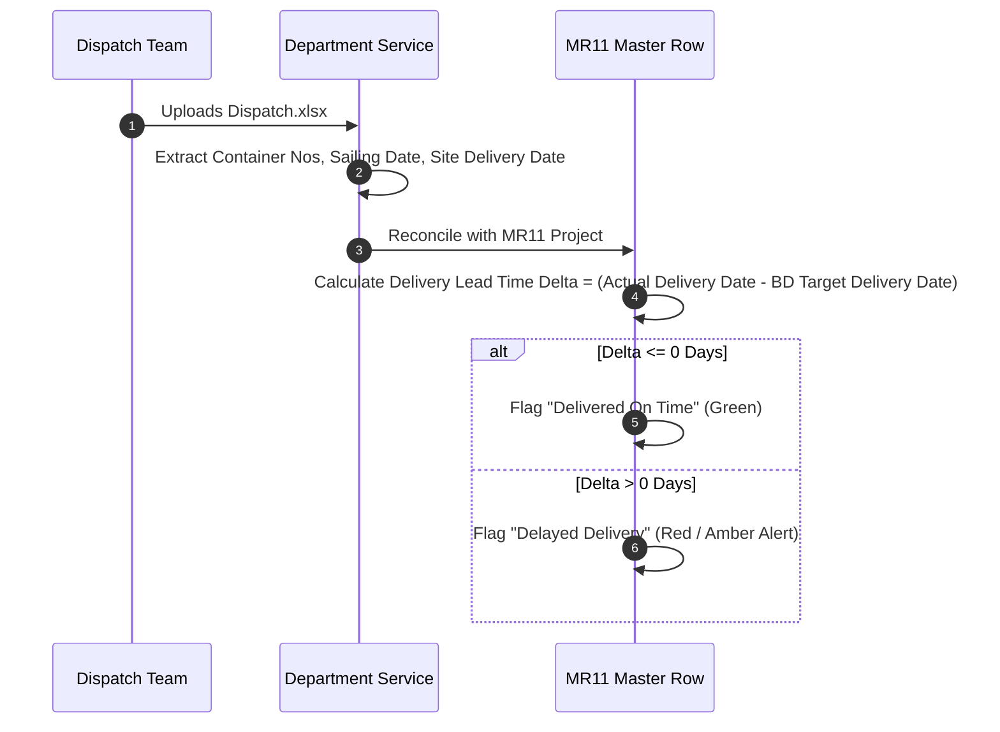

# Department Data Workflows & Field Mapping Guide

This document explains the data responsibility, column specifications, font color significance, and integration rules for each of the 7 operational departments contributing to the **MFE Formwork MR11 Master System**.

---

## 1. Department Overview & Information Flow



---

## 2. Business Development (BD) - Primary Seed Master

The BD workbook is the foundational driver of the entire MR11 pipeline. Every project represented in MR11 must originate from or match against the BD schedule.

```mermaid
flowchart TD
    BD_File[BD Schedule XLSX] --> BD_Parser[ExcelJS Extraction]
    BD_Parser --> ReadFields[Extract Critical Columns:<br/>- Project No<br/>- Project Shortname / Client<br/>- Stream (1, 2, 3)<br/>- Order Area (m2)<br/>- Target Delivery Date<br/>- Font Color Code]
    ReadFields --> ValidateColors[Normalize Font Color:<br/>• Black: Standard Production<br/>• Red: Urgent / Priority Stream<br/>• Blue: Plant Unit A<br/>• Green: Plant Unit B<br/>• Purple: Special Alloy / Prototype]
    ValidateColors --> SeedMR11[Seed Initial Rows in MR11 Engine]
```

### BD Key Columns:
- `Project No`: Primary alphanumeric identifier (e.g. `MFE-2024-001`, `PRJ-882`).
- `Project Shortname`: Human-readable customer or site abbreviation.
- `Stream`: Parallel fabrication stream identifier (`Stream 1`, `Stream 2`).
- `Area (m2)`: Total contract formwork surface area.
- `Target Delivery Date`: Customer agreed site delivery requirement.
- `Font Color`: Strategic plant allocation / line priority designation.

---

## 3. Finance Department - Commercial Clearance

The Finance workbook details payment status, commercial risks, and ensures manufacturing or shipping is not released without contractual clearances.



### Finance Key Columns:
- `Project No`: Project matching key.
- `Advance Payment %`: Percentage of contract advance credited.
- `Letter of Credit (LC) Status`: Active, Under Review, or Approved.
- `Payment Terms`: Milestone schedule (e.g., 30/60/10).

---

## 4. Shellplan Department - Architectural & Consultant Sign-offs

Shellplan manages pre-design architectural review, site elevations, and consultant drawing submittals.



### Shellplan Key Columns:
- `Consultant Approval Date`: Official date consultant authorized architectural layouts.
- `Revision Index`: Current revision tag (`Rev A`, `Rev B`, etc.).
- `Submission Status`: `Approved`, `Pending Comments`, `Resubmitted`.

---

## 5. Design Department - Engineering Release

The Design department translates approved shellplans into fabrication shop drawings and final bill of materials (BOM).



### Design Key Columns:
- `Design Release Date`: Factory engineering drawing release milestone.
- `Engineered Area (m2)`: Total formwork area modeled in 3D.
- `Design Status`: `Released`, `In Progress`, `Hold`.

---

## 6. Planning & Production - Dynamic Series Tracking

Planning and Production feature dynamic multi-series tracking. Formwork orders are delivered in sequential manufacturing series (Series 1, Series 2, Series 3, etc.).

```mermaid
flowchart TB
    subgraph PlanningFlow ["Planning Workflow"]
        PlanUpload[Upload Planning.xlsx] --> PlanScanner[Scan Series Columns (S1, S2, S3...)]
        PlanScanner --> PlanColor[Extract Cell Font Colors & Fills]
        PlanColor --> PlanUpsert[Upsert PlanningSeriesHistory Records:<br/>- projectNo<br/>- stream<br/>- fontColor<br/>- seriesNumber<br/>- totalProcessed]
        PlanUpsert --> PlanCalc[Update PlanningProjectQuantityTracker]
    end

    subgraph ProductionFlow ["Production Workflow"]
        ProdUpload[Upload Production.xlsx] --> ProdScanner[Scan Series Columns (S1, S2, S3...)]
        ProdScanner --> ProdColor[Extract Cell Font Colors & Fills]
        ProdColor --> ProdUpsert[Upsert ProductionSeriesHistory Records:<br/>- projectShortname<br/>- stream<br/>- fontColor<br/>- seriesNumber<br/>- totalFabricated]
    end

    subgraph MR11Consolidation ["MR11 Matching Logic"]
        MatchSeries[Align Planning & Production Series on: Project + Stream + Font Color]
        CompareSeries[Calculate Planning vs Production Gap: Processed m2 vs Fabricated m2]
        InjectMR11[Inject Total Processed m2 & Total Fabricated m2 into MR11 Master Row]
    end

    PlanCalc --> MatchSeries
    ProdUpsert --> MatchSeries
    MatchSeries --> CompareSeries
    CompareSeries --> InjectMR11
```

---

## 7. Dispatch Department - Logistics & Shipping

Dispatch coordinates crating, container stuffing, bill of lading, and sailing dates.



### Dispatch Key Columns:
- `Container Numbers`: Shipping container serial identifiers.
- `Estimated Sailing Date (ETD)`: Vessel departure date.
- `Actual Delivery Date`: On-site client handover date.
- `Dispatch Status`: `Loaded`, `Sailing`, `Customs Cleared`, `Delivered`.
