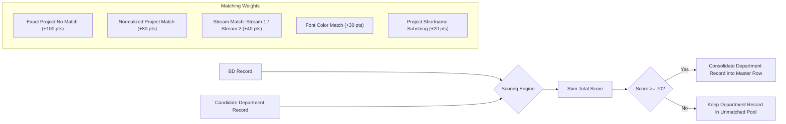
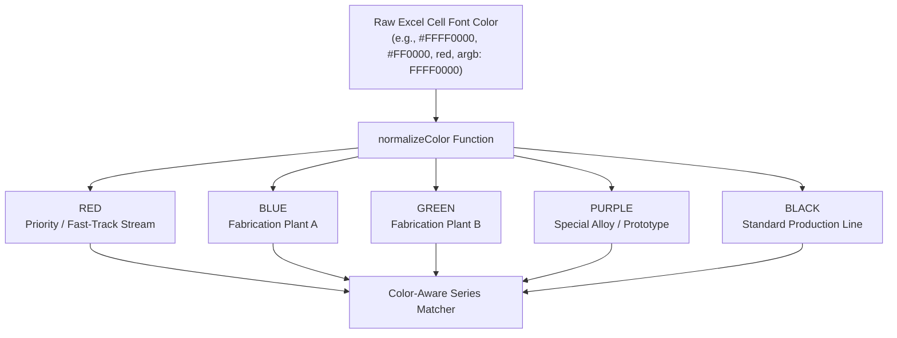

# MR11 Engine Deep Dive & Reconciliation Algorithm

This document provides a technical specification of the reconciliation algorithm implemented in `server/modules/mr11/mr11.engine.ts`.

---

## 1. Pipeline Execution Flow

The MR11 pipeline executes whenever any department uploads an updated workbook or when an administrator manually triggers a pipeline rebuild.

```mermaid
flowchart TD
    Trigger([Pipeline Triggered: Upload or Manual]) --> LockCheck{Is Pipeline Running?}
    LockCheck -- Yes --> QueueOrSkip[Queue or Skip redundant run]
    LockCheck -- No --> FetchActive[Fetch Active FileVersion for all 7 Departments from Prisma]

    FetchActive --> LoadWorkbooks[Load & Parse Worksheets with ExcelJS]
    LoadWorkbooks --> StyleExtract[Extract Cell Values, Background Fills, and Font Colors]

    StyleExtract --> LoadHistory[Fetch Historical Series & Trackers from Prisma:<br/>- planningSeriesHistory<br/>- planningProjectQuantityTracker<br/>- productionSeriesHistory]

    LoadHistory --> GroupByBD[Phase 1: Seed Master Records from BD Rows]
    GroupByBD --> EnrichFinance[Phase 2: Join Finance Commercial Data]
    EnrichFinance --> EnrichShellplan[Phase 3: Join Shellplan Drawing Approvals]
    EnrichShellplan --> EnrichDesign[Phase 4: Join Design Engineering Releases]
    EnrichDesign --> MatchPlanning[Phase 5: Color-Aware Match with Planning Series & Quantities]
    MatchPlanning --> MatchProduction[Phase 6: Color-Aware Match with Production Fabrication Data]
    MatchProduction --> EnrichDispatch[Phase 7: Join Dispatch Sailing & Delivery Metrics]

    EnrichDispatch --> DeriveFields[Phase 8: Derive KPIs, Variances, and Status Indicators]
    DeriveFields --> CreateSnapshot[Phase 9: Create MR11Run Snapshot (Prisma)]
    CreateSnapshot --> EmitComplete([Pipeline Complete - Status: READY])
```

---

## 2. Multi-Department Matching & Scoring Matrix

Matching data across 7 Excel files from independent departments requires resilient scoring because column names and project formatting often have minor naming discrepancies.



### Matching Algorithm Pseudocode:

```typescript
function computeMatchScore(bd: ExtractedRow, candidate: ExtractedRow): number {
  let score = 0;
  
  // 1. Exact project number
  if (cleanStr(bd.projectNo) === cleanStr(candidate.projectNo)) {
    score += 100;
  } else if (cleanStr(bd.projectNo).includes(cleanStr(candidate.projectNo))) {
    score += 70;
  }

  // 2. Stream alignment
  if (bd.stream && candidate.stream && bd.stream === candidate.stream) {
    score += 40;
  }

  // 3. Font color / plant priority alignment
  if (normalizeColor(bd.fontColor) === normalizeColor(candidate.fontColor)) {
    score += 30;
  }

  // 4. Shortname / client similarity
  if (bd.shortName && candidate.shortName && bd.shortName === candidate.shortName) {
    score += 20;
  }

  return score;
}
```

---

## 3. Font Color Significance & Normalization

Colors denote production plants and priorities in the factory. The engine normalizes RGB, ARGB, indexed colors, and color names:



---

## 4. Calculated Fields & Derivations

The table below describes how calculated fields are generated during Phase 8:

| Master Field | Formula / Source | Description |
| :--- | :--- | :--- |
| **`Total Contract Area (m2)`** | `BD['Area (m2)']` | Baseline area booked commercially |
| **`Total Processed (m2)`** | `Σ(PlanningSeriesHistory.totalProcessed)` | Realized factory cutting & stage completion |
| **`Balance to Process (m2)`** | `Contract Area - Total Processed` | Remaining work volume in the backlog |
| **`Production Fabrication (m2)`** | `Σ(ProductionSeriesHistory.totalFabricated)` | Finished goods off the welding / assembly line |
| **`Planning vs Prod Delta (m2)`** | `Total Processed - Total Fabricated` | Work-in-progress (WIP) buffer on factory floor |
| **`Delivery Delta (Days)`** | `Actual Delivery Date - Target Delivery Date` | Negative = Early, 0 = On Time, Positive = Delayed |
| **`Schedule Health Status`** | Evaluated conditionally | `ON_TRACK`, `DELAYED`, `COMMERCIAL_HOLD`, `DESIGN_HOLD` |
